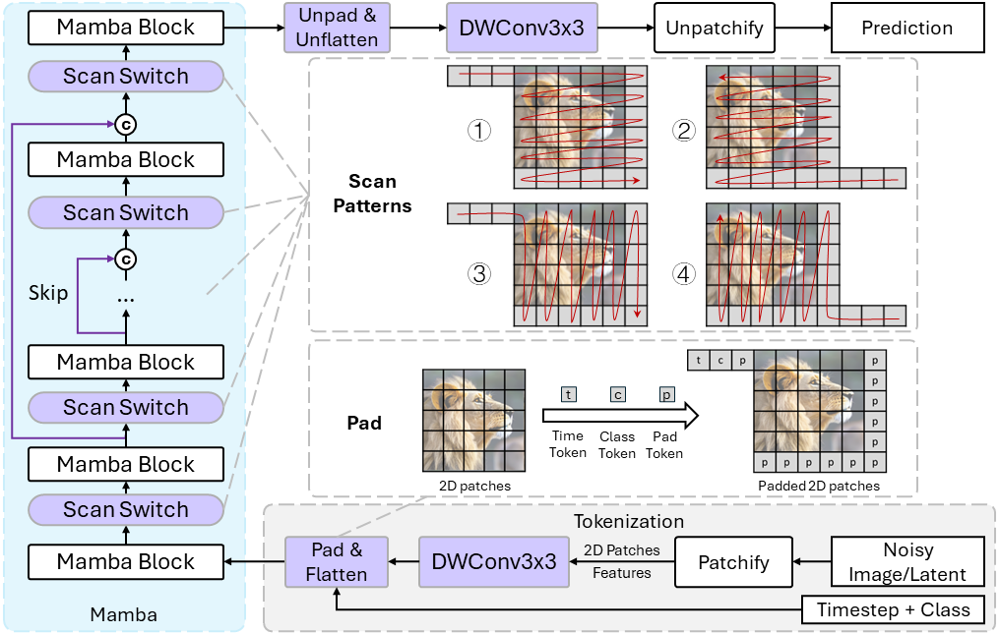

# DiM: Diffusion Mamba for Efficient High-Resolution Image Synthesis

The official implementation of our paper [DiM: Diffusion Mamba for Efficient High-Resolution Image Synthesis](https://arxiv.org/abs/2405.14224).


## Method Overview



## Acknowledge

This code is mainly built on [U-ViT](https://github.com/baofff/U-ViT) and [Mamba](https://github.com/state-spaces/mamba).

Installing Mamba may cost a lot of effort. If you encounter problems, this [issues in Mamba](https://github.com/state-spaces/mamba/issues) may be very helpful.

## Installation

```bash
# create env:
conda env create -f environment.yaml

# if you want to update the env `mamba` with the contents in `~/mamba_attn/environment.yaml`:
conda env update --name mamba --file ~/mamba_attn/environment.yaml --prune

# Switch to the correct environment
conda activate mamba-attn
conda install chardet

# Compiling Mamba. This step may take a lot of time, please be patient.
# You need to successfully install causal-conv1d first.
CAUSAL_CONV1D_FORCE_BUILD=TRUE pip install --user -e .
# If failing to compile, you can copy the files in './build/' from another server which has compiled successfully; Maybe --user is necessary.

# Optional: if you have only 8 A100 to train Huge model with a batch size of 768, I recommand to install deepspeed to reduce the required GPU memory:
pip install deepspeed
```

**Frequently Asked Questions:**

- If you encounter errors like `ModuleNotFoundError: No module named 'selective_scan_cuda'`:
  
  **Answer**: you need to correctly **install and compile** Mamba:
  
  ```bash
  pip install causal-conv1d==1.2.0.post2 # The version maybe different depending on your cuda version
  CAUSAL_CONV1D_FORCE_BUILD=TRUE pip install --user -e .
  ```

- failed Compilation: 
  
  - The detected CUDA version mismatches the version that was used to **compile** PyTorch. Please make sure to use the same CUDA versions:
  
    **Answer**: you need to reinstall Pytorch with the correct version:
  
    ```bash
    # For example, on cuda 11.8:
    conda install pytorch==2.1.1 torchvision==0.16.1 torchaudio==2.1.1 pytorch-cuda=11.8 -c pytorch -c nvidia
    # Then, compiling the mamba in our project again:
    CAUSAL_CONV1D_FORCE_BUILD=TRUE pip install --user -e .
    ```

## Preparation Before Training and Evaluation

Please follow [U-ViT](https://github.com/baofff/U-ViT), the same subtitle.

## Checkpoints

|                            Model                             |   FID    | training iterations | batch size |
| :----------------------------------------------------------: | :------: | :-----------------: | :--------: |
| [ImageNet 256x256 (Huge/2)](https://drive.google.com/drive/folders/1TTEXKKhnJcEV9jeZbZYlXjiPyV87ZhE0?usp=sharing) |   2.40   |        425K         |    768     |
| [ImageNet 256x256 (Huge/2)](https://drive.google.com/drive/folders/1ETllUm8Dpd8-vDHefQEXEWF9whdbyhL5?usp=sharing) | **2.21** |        625K         |    768     |
| [ImageNet 512x512 (fine-tuned Huge/2)](https://drive.google.com/drive/folders/1lupf4_dj4tWCpycnraGrgqh4P-6yK5Xe?usp=sharing) |   3.94   |      Fine-tune      |    240     |

**About the checkpoint files:**

- **We use `nnet_ema.pth` for evaluation instead of `nnet.pth`.**

- **`nnet.pth` is the trained model, while `nnet_ema.pth` is the EMA of model weights.**

## Evaluation

**Use `eval_ldm_discrete.py` for evaluation and generating images with CFG**

```sh
# ImageNet 256x256 Huge, 425K
# If your model checkpoint path is not 'workdir/imagenet256_H_DiM/default/ckpts/425000.ckpt/nnet_ema.pth', you can change the path after '--nnet_path='
accelerate launch --multi_gpu --gpu_ids 0,1,2,3,4,5,6,7 --main_process_port 20039 --num_processes 8 --mixed_precision bf16 ./eval_ldm_discrete.py --config=configs/imagenet256_H_DiM.py --nnet_path='workdir/imagenet256_H_DiM/default/ckpts/425000.ckpt/nnet_ema.pth'

# ImageNet 512x512 Huge
# The generated 512x512 images for evaluation cost ~22G.
# So I recommend setting a path to `config.sample.path` in the config `imagenet512_H_DiM_ft` if the space is tight for temporary files.
accelerate launch --multi_gpu --gpu_ids 0,1,2,3,4,5,6,7 --main_process_port 20039 --num_processes 8 --mixed_precision bf16 ./eval_ldm_discrete.py --config=configs/imagenet512_H_DiM_ft.py --nnet_path='workdir/imagenet512_H_DiM_ft/default/ckpts/64000.ckpt/nnet_ema.pth'

# ImageNet 512x512 Huge, upsample 2x, the generated images are in `workdir/imagenet512_H_DiM_ft/test_tmp` which is set in config.
accelerate launch --multi_gpu --gpu_ids 0,1,2,3,4,5,6,7 --main_process_port 20039 --num_processes 8 --mixed_precision bf16 ./eval_ldm_discrete.py --config=configs/imagenet512_H_DiM_upsample_test.py --nnet_path='workdir/imagenet512_H_DiM_ft/default/ckpts/64000.ckpt/nnet_ema.pth'

# ImageNet 512x512 Huge, upsample 3x, the generated images are in `workdir/imagenet512_H_DiM_ft/test_tmp` which is set in config.
accelerate launch --multi_gpu --gpu_ids 0,1,2,3,4,5,6,7 --main_process_port 20039 --num_processes 8 --mixed_precision bf16 ./eval_ldm_discrete.py --config=configs/imagenet512_H_DiM_upsample_3x_test.py --nnet_path='workdir/imagenet512_H_DiM_ft/default/ckpts/64000.ckpt/nnet_ema.pth'
```

## Training

```sh
# Cifar 32x32 Small
accelerate launch --multi_gpu --num_processes 8 --mixed_precision fp16 ./train.py --config=configs/cifar10_S_DiM.py

# ImageNet 256x256 Large
accelerate launch --multi_gpu --num_processes 8 --mixed_precision bf16 ./train_ldm_discrete.py --config=configs/imagenet256_L_DiM.py

# ImageNet 256x256 Huge (Deepspeed Zero-2 for memory-efficient training)
accelerate launch --multi_gpu --num_processes 8 --mixed_precision bf16 ./train_ldm_discrete.py --config=configs/imagenet256_H_DiM.py

# ImageNet 512x512 Huge (Deepspeed Zero-2 for memory-efficient training)
# Fine-tuning, and you need to carefully check whether
# the pre-trained weights are in `workdir/imagenet256_H_DiM/default/ckpts/425000.ckpt/nnet_ema.pth`.
# This location is set in the config file: `config.nnet.pretrained_path`.
# If there is no such ckpt, no pre-training weight will be loaded.
accelerate launch --multi_gpu --num_processes 8 --mixed_precision bf16 ./train_ldm_discrete.py --config=configs/imagenet512_H_DiM_ft.py
```

# Citation

```
@misc{teng2024dim,
      title={DiM: Diffusion Mamba for Efficient High-Resolution Image Synthesis}, 
      author={Yao Teng and Yue Wu and Han Shi and Xuefei Ning and Guohao Dai and Yu Wang and Zhenguo Li and Xihui Liu},
      year={2024},
      eprint={2405.14224},
      archivePrefix={arXiv},
      primaryClass={cs.CV}
}
```

# Testing For Myself
큰 데이터셋으로 확인하는 것 보다는 32x32x3 크기인 cifar dataset으로 학습 코드 점검
```
# Cifar 32x32 Small
accelerate launch --mixed_precision fp16 ./train.py --config=configs/cifar10_S_DiM.py
```
현재는 다중 gpu가 아닌, 단일 gpu를 활용하고 있기 때문에,  --multi_gpu --num_processes 8 flag는 사용하지 않는다.  
향후, 다중 gpu를 사용하게 된다면 아래와 같이 학습을 진행하면된다.
```
accelerate launch --multi_gpu --num_processes 8 --mixed_precision fp16 ./train.py --config=configs/cifar10_S_DiM.py
```
## 알아낸 것 by GPT
1. --multi_gpu flag는 다중 GPU가 있을 때만 활용할 것.
2. accelerate에서 --num_processes는 GPU 수와 동일하게 설정할 것.